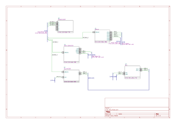

# PoorMansWiringDiagram

## Overview

This project was developed to address the challenges of creating wiring plans in environments where resources for professional tools are limited. The goal is to leverage **KiCad**, a free and open-source PCB design tool, as a platform for generating wiring schematics and connection overviews.

The script processes KiCad schematic files, extracting information about buses (representing cables) and their connections to various devices. It outputs a comprehensive overview of all connections, including their endpoints, descriptions, and part numbers. In the future, this project could integrate with **Wirewiz** to automate detailed wire drawings.

## Features

- **Bus and Symbol Processing**: Each device must have a corresponding KiCad symbol. Cables are defined as buses with optional descriptions and part numbers.
- **Connection Overview**: The script parses the schematic to generate a table of all connections with endpoints and metadata.
- **Scalable and Open Source**: Built on KiCad, making it accessible and cost-effective.

## Requirements

- **Python**: The script is written in Python and requires the `skip` module to parse KiCad schematics. Install it via `pip` if not already available.
- **KiCad**: Ensure KiCad is installed and schematics are prepared using it.
- **KiCad-Skip Library**: Uses the [KiCad-Skip](https://github.com/psychogenic/kicad-skip) library for parsing schematic files.

## Usage

1. **Prepare Schematic**:
   - Define each device as a **symbol** in KiCad.
   - Represent each cable as a **bus**.
   - Add **Description** and **Part Number** to each bus as properties.



2. **Run the Script**:
   - Run the script with the schematic file as input:
     ```bash
     python GenerateCableList.py
     ```

3. **View Output**:
   - The script processes the schematic and displays a table of connections:
```
Bus Name   Wire Name  To Part - Pin From Part - Pin Description P/N       
======================================================================
DMM_OUT    DMM_1                U5 - +               U2 - OUT_P           N/A                  N/A       
DMM_OUT    DMM_2                U5 - -               U2 - OUT_N           N/A                  N/A       
LAN        LAN_1                U1 - LAN1            U4 - LAN             RJ45-Cable           131-432-423
LAN        LAN_2                U1 - LAN2            U2 - LAN             RJ45-Cable           131-432-423
LAN_A      LAN_A_1              U5 - LAN             U1 - LAN4            N/A                  N/A       
USB        USB_1                U2 - USB             U4 - USB2            USB Cable 2m         123-422-123
VCC        AC230V_1             U4 - 230VAC          U6 - 1               test                 123-445-234
VCC        AC230V_2             U5 - 230VAC          U6 - 2               test                 123-445-234
VCC        AC230V_3             U1 - 230VAC          U6 - 3               test                 123-445-234
```

## Future Plans

- **Wire Drawing Automation**: Integration with **Wirewiz** to generate detailed wire diagrams.
- **Improved UI/UX**: Enhance the usability of the tool with a graphical interface or more intuitive output formats.

## Contributing

Contributions are welcome! If you have ideas or improvements, please submit a pull request or open an issue on the repository.

## License

This project is licensed under the MIT License. See the `LICENSE` file for details.

---

**Note**: While this tool is designed for limited-resource environments, it remains a powerful aid for creating organized and detailed wiring documentation.
